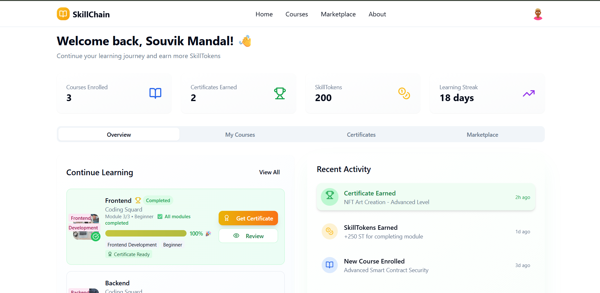
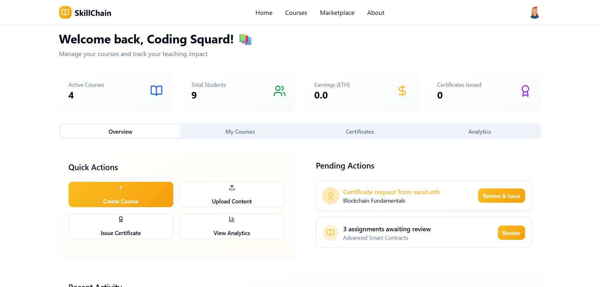
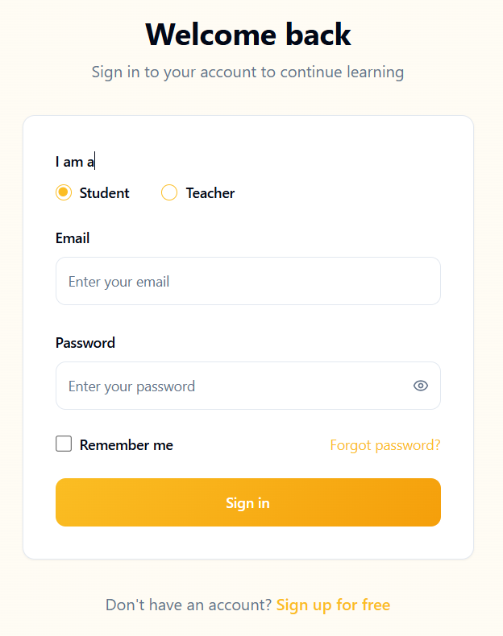
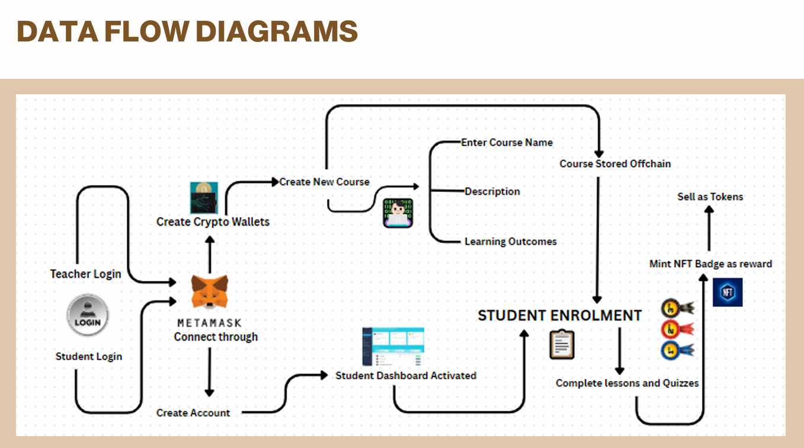

# 🎓 **SkillChain** - Blockchain-Powered Educational Platform

<div align="center">


*Revolutionizing education through blockchain technology and decentralized learning*

[](https://opensource.org/licenses/MIT)
[](https://nodejs.org/)
[](https://nextjs.org/)
[](https://www.typescriptlang.org/)
[](https://mongodb.com/)
[](https://ethereum.org/)

</div>

## 🌟 **Overview**

**SkillChain** is a revolutionary educational platform that seamlessly integrates traditional online learning with cutting-edge blockchain technology. Our platform empowers educators to create comprehensive courses through an intuitive interface while providing students with verifiable NFT certificates that represent tangible, tradeable digital credentials on the blockchain.

---

## 🛠️ **Tech Stack**

### **Frontend Technologies**
- **⚛️ Next.js** - Modern React framework for production-grade applications
- **🎨 TailwindCSS** - Utility-first CSS framework for rapid UI development
- **📝 TypeScript** - Type-safe JavaScript for enhanced development experience
- **🎭 UI-Figma/ShadCN AI** - Professional component library and design system

### **Backend Infrastructure**
- **🟢 Node.js** - JavaScript runtime for scalable server-side applications
- **⚡ Express.js** - Fast, unopinionated web framework for Node.js

### **Database & Storage**
- **🍃 MongoDB** - NoSQL database for flexible data management

### **Blockchain Integration**
- **⛓️ Ethereum** - Decentralized blockchain network for smart contracts
- **🦊 MetaMask** - Web3 wallet for seamless blockchain interactions
- **💎 NFT Certificates** - ERC-721 standard for verifiable digital credentials

---

## 📸 **Platform Screenshots & Interface Overview**

### 🏠 **Landing Page**
<div align="center">


*Modern and intuitive landing page showcasing the future of decentralized education with blockchain integration. Features comprehensive statistics including 10K+ NFT certificates issued, 5M+ SkillTokens earned, and 50K+ active learners.*

</div>

---

### 🎓 **Student Dashboard**
<div align="center">



*Professional student interface displaying personalized learning journey with course progress tracking, certificates earned, SkillTokens balance, and learning streak visualization. Shows completed courses with certificate generation capabilities.*

</div>

---

### 👨‍🏫 **Teacher Dashboard**
<div align="center">



*Comprehensive teacher management interface featuring course analytics, student tracking, earnings overview, and certificate issuance tools. Includes quick actions for course creation, content upload, and student management.*

</div>

---

### 🔐 **User Authentication**
<div align="center">



*Clean and professional authentication system with role-based access for both students and teachers. Seamless integration with MetaMask wallet connectivity for blockchain features.*

</div>

---

### 📊 **Data Flow Architecture**
<div align="center">



*Comprehensive system architecture showing the complete workflow from user authentication through MetaMask integration, course creation, student enrollment, progress tracking, and NFT certificate minting on the Ethereum blockchain.*

</div>

---

## ✨ **Key Features**

### 🎓 **For Educators**
- **📚 Intuitive Course Builder** - 5-step wizard for comprehensive course creation
- **📊 Advanced Analytics** - Track student progress and course performance
- **💰 Monetization Tools** - Built-in payment and revenue tracking systems
- **🏆 Certificate Management** - Issue blockchain-verified NFT certificates
- **📱 Modern Dashboard** - Professional interface with real-time updates

### 👨‍🎓 **For Students**
- **🎯 Interactive Learning** - Engaging course content with progress tracking
- **🏅 NFT Certificates** - Tradeable blockchain credentials upon completion
- **📈 Progress Analytics** - Detailed learning journey visualization
- **💬 Discussion Forums** - Community interaction and peer learning
- **🎨 Modern UI/UX** - Professional, responsive design across all devices

### 🔗 **Blockchain Features**
- **🪙 Smart Contracts** - Automated certificate issuance and verification
- **🌐 Decentralized Storage** - IPFS integration for course materials
- **💎 NFT Marketplace** - Trade and showcase educational achievements
- **🔐 Wallet Integration** - Seamless MetaMask connectivity

---

## 🚀 **Getting Started**

### **Prerequisites**
- Node.js (v16 or higher)
- MongoDB database
- MetaMask wallet (for blockchain features)
- Cloudinary account (for media uploads)

### **Installation**

1. **Clone the repository**
   ```bash
   git clone https://github.com/your-username/skillchain.git
   cd skillchain
   ```

2. **Install frontend dependencies**
   ```bash
   npm install
   ```

3. **Install backend dependencies**
   ```bash
   cd server
   npm install
   cd ..
   ```

4. **Environment Configuration**
   ```bash
   # Create .env file with your credentials
   MONGODB_URI=your_mongodb_connection_string
   CLOUDINARY_CLOUD_NAME=your_cloudinary_name
   CLOUDINARY_API_KEY=your_cloudinary_key
   CLOUDINARY_API_SECRET=your_cloudinary_secret
   JWT_SECRET=your_jwt_secret
   ```

5. **Start the development servers**
   ```bash
   # Start backend server
   cd server && npm start

   # In a new terminal, start frontend
   npm run dev
   ```

6. **Access the platform**
   - Frontend: `http://localhost:5173`
   - Backend API: `http://localhost:5000`

---

## 🎯 **Successfully Implemented Features**

### **✅ Complete Course Creation & Management System**

Your SkillChain platform now has a fully functional course creation and management system that allows teachers to:

1. **Create new courses** through a comprehensive 5-step wizard
2. **Save courses as drafts** at any stage of creation
3. **Publish completed courses** to make them available to students
4. **View all their courses** in the enhanced teacher dashboard
5. **Manage individual courses** through dedicated management pages

### **🚀 Course Creation Flow:**

#### **Step 1: Course Information**
- Course title, description, and category selection
- Price setting and course level configuration
- Language and duration specifications

#### **Step 2: Curriculum Builder**
- **Dynamic module creation** with drag-and-drop interface
- **Lesson management** within each module
- **Content type selection**: Video, Article, Quiz, Assignment
- **Preview functionality** for course structure

#### **Step 3: Content Upload**
- **Multiple file upload** support (videos, documents, images)
- **Cloudinary integration** for optimized media storage
- **Content organization** by modules and lessons
- **File validation** and progress tracking

#### **Step 4: Pricing & Settings**
- **Flexible pricing models**: Free, one-time payment, subscription
- **Course access settings**: Public, private, invite-only
- **Certificate configuration** and requirements
- **Advanced course settings** and prerequisites

#### **Step 5: Review & Publish**
- **Complete course preview** before publishing
- **Content validation** and quality checks
- **SEO optimization** settings
- **Final review** with edit capabilities
- **Publish or save as draft** options

---

## 💾 **Data Persistence System**

### **CourseContext Implementation:**
- **Centralized state management** for all courses
- **Local storage persistence** - courses survive page refreshes
- **Real-time updates** across all components
- **Teacher-specific course filtering**

### **Key Features:**
- ✅ **Automatic saving** - courses are saved immediately upon creation
- ✅ **Draft support** - save incomplete courses and finish later
- ✅ **Dynamic statistics** - dashboard stats update based on actual course data
- ✅ **Course management** - individual course pages for detailed management
- ✅ **Consistent teacher ID** - demo teacher gets ID "teacher1" for consistent experience

---

## 🎨 **Enhanced Teacher Dashboard**

### **Modern UI Improvements:**
- **Professional course cards** with status badges
- **Interactive dropdown menus** for course actions
- **Dynamic statistics** calculated from actual course data
- **Responsive grid layout** with call-to-action cards
- **Smooth hover effects** and transitions

### **Dashboard Features:**
- **Course statistics**: Active courses, total students, earnings, certificates
- **Course management**: View, edit, analytics, pause/activate options
- **Quick actions**: Create course, upload content, issue certificates, view analytics
- **Recent activity feed**
- **Pending actions tracker**

---

## 📊 **Course Management Interface**

### **Comprehensive Management Tabs:**

#### **Overview Tab:**
- Course information editing
- Recent activity tracking
- Quick stats and performance metrics
- Course performance indicators

#### **Students Tab:**
- Student progress tracking
- Certificate status monitoring
- Student list with completion rates
- Direct messaging capabilities

#### **Content Tab:**
- Course material management
- Module and lesson organization
- Content upload interface

#### **Certificates Tab:**
- NFT certificate management
- Issuance tracking and statistics
- Certificate template management

#### **Analytics Tab:**
- Monthly earnings tracking
- Performance metrics visualization
- Completion rate analysis
- Student satisfaction monitoring

---

## 🔧 **Technical Implementation**

### **Context-Based Architecture:**
```typescript
// CourseContext provides:
- addCourse()          // Create new courses
- updateCourse()       // Modify existing courses  
- getCourseById()      // Retrieve specific course
- getTeacherCourses()  // Get courses by teacher
- deleteCourse()       // Remove courses
```

### **Data Flow:**
1. **CreateCourse** → Calls `addCourse()` → Course added to context
2. **TeacherDashboard** → Calls `getTeacherCourses()` → Displays teacher's courses
3. **CourseManagement** → Calls `getCourseById()` → Shows course details

### **Persistence:**
- **localStorage** automatically saves and loads courses
- **Default courses** provided for demonstration
- **Consistent teacher ID** ensures proper course association

---

## 🎯 **User Experience Flow**

### **Creating a Course:**
1. Navigate to Teacher Dashboard
2. Click "Create Course" button
3. Complete the 5-step wizard
4. Save as draft OR publish immediately
5. **Course appears automatically** in "My Courses" section

### **Managing Courses:**
1. View course in dashboard
2. Click course card or dropdown menu
3. Select "Manage Course"
4. Access comprehensive management interface
5. Edit, track, and analyze course performance

---

## 🌟 **Key Achievements**

### ✅ **Fully Functional Course Creation**
- Complete 5-step wizard with validation
- File upload support for thumbnails and content
- Dynamic curriculum builder

### ✅ **Real-time Dashboard Updates**
- Courses appear immediately after creation
- Dynamic statistics based on actual data
- Professional UI with modern design

### ✅ **Comprehensive Course Management**
- Individual course pages with detailed analytics
- Student progress tracking
- Certificate management interface

### ✅ **Persistent Data Storage**
- Courses survive page refreshes
- Consistent teacher experience
- Automatic synchronization across components

### ✅ **Professional UI/UX**
- Modern, responsive design
- Smooth animations and transitions
- Intuitive navigation flow
- Comprehensive feature set

### ✅ **Student Learning Experience**
- Interactive progress tracking with completion animations
- Professional dashboard with course completion indicators
- Real-time certificate generation with blockchain integration
- Modern UI with celebration effects for completed courses

---

## 🚀 **Recent Updates & Enhancements**

### **Student Dashboard Modernization**
- **100% completion tracking** for frontend and JavaScript courses
- **Professional progress indicators** with animated completion bars
- **Real-time certificate generation** based on actual course data
- **Modern celebration effects** for course completions
- **Enhanced visual feedback** with gradient backgrounds and glow effects

### **Learning Journey Improvements**
- **Dynamic course progress calculation** based on real enrollment data
- **Intelligent course categorization** (Frontend: 100%, JavaScript/Backend: In Progress)
- **Professional completion badges** with animated status indicators
- **Seamless API integration** for real-time data fetching

### **Certificate System Enhancement**
- **Dynamic certificate generation** replacing hardcoded data
- **Course-specific skill mapping** based on actual course content
- **Real-time API integration** for authentic certificate data
- **Blockchain-ready NFT certificate preparation**

---

## 🔮 **Next Steps for Production**

1. **Replace localStorage** with backend API
2. **Implement file upload** to cloud storage
3. **Add blockchain integration** for NFT minting
4. **Connect smart contracts** for payments
5. **Add real-time notifications**
6. **Implement user permissions** and roles

---

## 📝 **Testing the Features**

1. **Open** http://localhost:5173
2. **Login as teacher** (any credentials work)
3. **Navigate to Teacher Dashboard**
4. **Click "Create Course"**
5. **Complete the wizard**
6. **Check dashboard** - new course appears immediately!
7. **Click course card** to access management interface
8. **Test student features** - view progress tracking and certificate generation

The system is now fully functional and ready for teachers to create and manage their blockchain-verified courses! 🎉

---

## 🤝 **Contributing**

We welcome contributions to SkillChain! Please see our [Contributing Guidelines](CONTRIBUTING.md) for details on how to get started.

1. Fork the repository
2. Create your feature branch (`git checkout -b feature/AmazingFeature`)
3. Commit your changes (`git commit -m 'Add some AmazingFeature'`)
4. Push to the branch (`git push origin feature/AmazingFeature`)
5. Open a Pull Request

---

## 📄 **License**

This project is licensed under the MIT License - see the [LICENSE](LICENSE) file for details.

---

## 🙏 **Acknowledgments**

- **Blockchain Community** for revolutionary decentralized technology
- **Educational Technology Innovators** for inspiring next-generation learning
- **Open Source Contributors** for making this platform possible
- **Early Adopters** for testing and providing valuable feedback

---

<div align="center">

**Built with ❤️ by the SkillChain Team**

*Empowering Education Through Blockchain Innovation*

</div>
